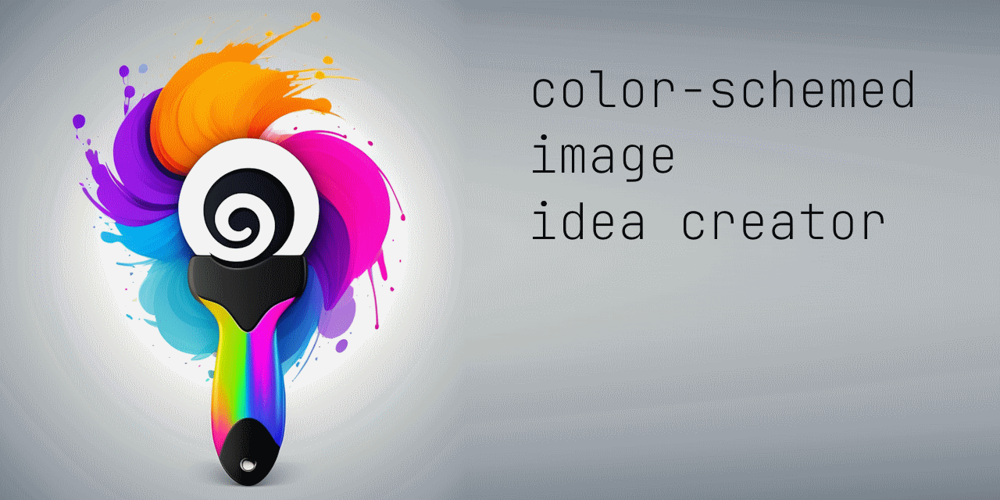

- prefix describes overall style 
- body describes details of the picture
- suffix describes details of the style
- for img2img prefix and suffix are ignored
- prompt for img2img is the body only from idea image. If there is prompt-img2img presented then take this prompt as override for img2img generation
- PrepareImages.py will generate img only if there is no output image in Images folder (so it just will regenerate absent pictures). User can always delete bad images and the script will regenerate only absent
- GenerateIdea.py will create low resoultion draft which inlude composition and style
- PrepareImages.py will create final ready to use image with specified color palette and final details and resolution


Working pipeline
- user prepare json in ImgIdeas folder and run GenerateIdea.py to generate draft for the idea. If draft is not good enough user can delete the image and regenerate
- user run PrepareImages.py to generate final images based on draft ideas and specified color schemes


# 🎨 Color-Schemed Image Generator

A two-stage image generation system using Stable Diffusion for producing stylized, color-controlled artworks from idea prompts.



---

## 📌 Overview

This project allows you to:

1. **Generate draft images** from idea JSON files using `txt2img`.
2. **Recolor and upscale** those drafts using `img2img` with defined color schemes.

It’s designed to allow iterative improvement: start with a prompt, tweak or discard drafts, then generate polished final images with palette constraints.

---

## 📂 Directory Structure

```
project-root/
├── ImgIdeas/ # Source idea JSONs and prompt files
│ └── [subfolders]/ # Each idea goes in its own subfolder
│ ├── idea.json
│ ├── prefix.txt # (optional) prompt prefix
│ ├── suffix.txt # (optional) prompt suffix
│ └── ignore # (optional) disables this folder
├── Recolored/ # Temp folder for palette-mapped intermediate images
├── Images/ # Final upscaled images
├── GenerateIdea.py # Script to create low-res draft images
├── PrepareImages.py # Script to recolor and upscale to final output
└── README.md
```

---

## ⚙️ How It Works

### 🖋 `GenerateIdea.py`

- **Purpose**: Quickly generate draft compositions using `txt2img`.
- **Input**: JSON prompt file in `ImgIdeas/`
- **Behavior**:
  - Reads `prompt`, `prefix.txt`, `suffix.txt`
  - Outputs a 768x768 image in the same folder
  - Skips generation if output image already exists

### 🎨 `PrepareImages.py`

- **Purpose**: Generate final images using `img2img` and a custom color palette.
- **Input**: PNG draft from `GenerateIdea.py`, and matching `.json` file
- **Behavior**:
  - Recolors the draft to match a named color scheme
  - Sends the recolored image through `img2img` for high-resolution output
  - Only generates images that are missing in `Images/`

---

## 💡 Prompt Structure

Each JSON file should contain:
```json
{
  "prompt": "a rabbit warrior in a bamboo forest",
  "prompt-img2img": "a rabbit warrior, dynamic pose, bamboo background", <-- optional
  "negative_prompt": "blurry, low quality",
  "width": 768,
  "height": 768,
  "steps": 26,
  "seed": 123456,
  "sampler_name": "Euler a",
  "scheduler": "Karras",
  "cfg_scale": 7.0,
  "denoising_strength": 0.65
}

- `prompt` is used for txt2img generation.
- `prompt-img2img` (optional) overrides prompt in img2img.
- `prefix.txt` and `suffix.txt` (optional): automatically added to prompt in GenerateIdea.py.
- `ignore`: placing a file named `ignore` in a folder will exclude it from processing.


## 🚀 How to Use

1. Add an idea:
  - Create a new folder inside `ImgIdeas/`
  - Add idea.json, and optionally prefix.txt, suffix.txt

2. Generate draft:
- Run `python GenerateIdea.py`. This creates 768x768 drafts directly in the subfolders.
- You can delete or tweak drafts and rerun.

3. Generate final image:
- Run `python PrepareImages.py`. This generates high-resolution, palette-constrained outputs in `Images/`.
- Will only regenerate if the image is missing.
- You can delete final result and rerun to regenerate it.